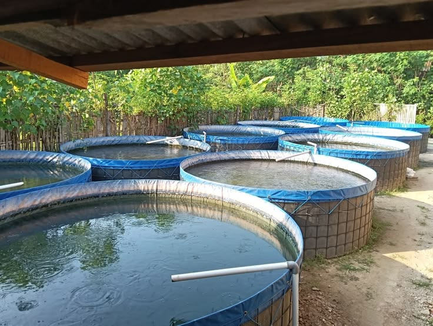

# 🐟 Budidaya Ikan Gurame — Project PKWU Rekayasa Teknologi

Website tugas PKWU (Prakarya dan Kewirausahaan) bidang **Rekayasa Teknologi**, membahas project **budidaya ikan gurame**: alasan pemilihan, cara budidaya, modal awal, hasil panen, hingga cara mengolah dan menjualnya (marketplace/restoran, dibakar/digoreng).

Desain memakai palet cream & terracotta dengan aksen *pond-green*, plus animasi bertema "riak air kolam": cursor custom, efek klik seperti percikan air, water-level gauge saat scroll, scroll-reveal, dan tab interaktif.

## 📁 Isi folder

```
├── index.html     -> seluruh konten & struktur halaman
├── style.css       -> semua styling & animasi
├── script.js       -> logic animasi (cursor, scroll, tab, dll)
└── README.md       -> panduan ini
```

Semua file **statis** (HTML/CSS/JS murni), tidak perlu proses build apa pun — tinggal upload dan langsung bisa di-deploy ke GitHub Pages.

## ✏️ Yang sebaiknya kamu sesuaikan

Sebelum di-deploy, cek dan ganti bagian ini di `index.html` supaya sesuai kondisi kelompok kamu:

- Nama kelompok / anggota (bisa ditambahkan di bagian footer).
- Angka-angka di bagian **Modal Awal** dan **Hasil Panen** — sesuaikan dengan data budidaya kalian yang sebenarnya.
- Bagian **Galeri** memakai ilustrasi SVG sederhana (bukan foto asli) supaya website tetap ringan dan tidak bergantung koneksi internet untuk gambar. Kalau punya foto dokumentasi asli, kamu bisa menggantinya — lihat panduan singkat di bawah.

### Cara mengganti ilustrasi galeri dengan foto asli

1. Upload foto kamu ke repo (misalnya folder `images/`, contoh: `images/kolam.jpg`).
2. Di `index.html`, cari blok `<div class="gallery-card__art g1">...</div>` lalu ganti isinya dengan:
   ```html
   
   ```
3. Ulangi untuk kartu galeri lainnya (`g2`, `g3`, `g4`).

## 🚀 Cara upload & deploy lewat HP (GitHub mobile web)

Berikut langkah paling praktis lewat browser HP, tanpa perlu aplikasi tambahan.

1. **Buat repository baru**
   - Buka github.com lewat browser HP, login ke akun kamu.
   - Tap ikon **+** di kanan atas → **New repository**.
   - Isi nama repo, misalnya `budidaya-gurame-pkwu`.
   - Pilih **Public**, centang **Add a README file** boleh dilewati (karena kita sudah punya README sendiri).
   - Tap **Create repository**.

2. **Upload semua file**
   - Di halaman repo, tap **Add file** → **Upload files**.
   - Tap area upload, pilih **Browse** lalu pilih ke-4 file: `index.html`, `style.css`, `script.js`, `README.md` (upload sekaligus/multi-select dari file manager HP).
   - Scroll ke bawah, isi pesan commit (contoh: "Upload website budidaya gurame"), lalu tap **Commit changes**.

3. **Aktifkan GitHub Pages**
   - Di halaman repo, tap menu **Settings** (kalau tidak terlihat, tap ikon menu ☰ atau geser tab di bagian atas repo untuk menemukan Settings).
   - Di sidebar/scroll ke bawah, cari menu **Pages**.
   - Pada bagian **Build and deployment → Source**, pilih **Deploy from a branch**.
   - Pada **Branch**, pilih `main` (atau `master`) dan folder `/ (root)`, lalu tap **Save**.

4. **Buka website kamu**
   - Tunggu 1–2 menit, refresh halaman **Settings → Pages**.
   - Akan muncul link seperti:
     `https://<username-kamu>.github.io/budidaya-gurame-pkwu/`
   - Buka link tersebut — website sudah live dan bisa dibagikan ke guru/teman.

> Setiap kali kamu upload ulang atau edit file lewat GitHub (tap ikon pensil di file → edit → Commit changes), GitHub Pages akan otomatis update dalam 1–2 menit.

## 🖌️ Ringkasan desain

| Elemen | Pilihan |
|---|---|
| Warna latar | Cream hangat (`#F7F1E7`) |
| Warna aksen utama | Terracotta (`#C96442`) |
| Warna aksen sekunder | Pond green (`#5F7A61`) — merepresentasikan air kolam |
| Font judul | Fraunces (serif berkarakter) |
| Font teks | Inter (sans-serif, mudah dibaca) |
| Motif animasi | Riak air: cursor custom, splash saat klik, water-level gauge saat scroll, garis gelombang antar-section |

Selamat mengerjakan tugas PKWU-nya! 🎣
